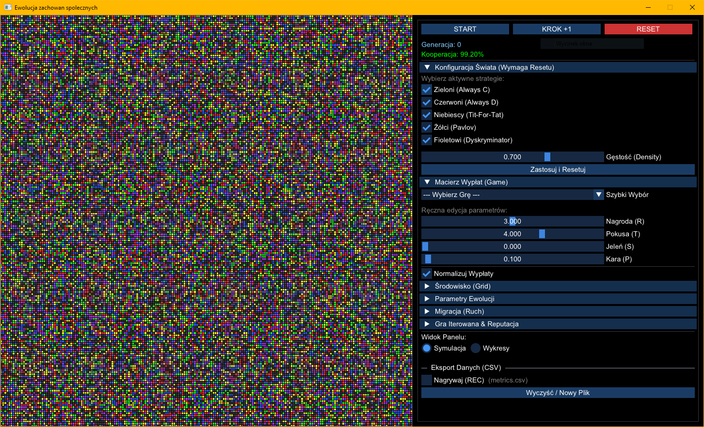
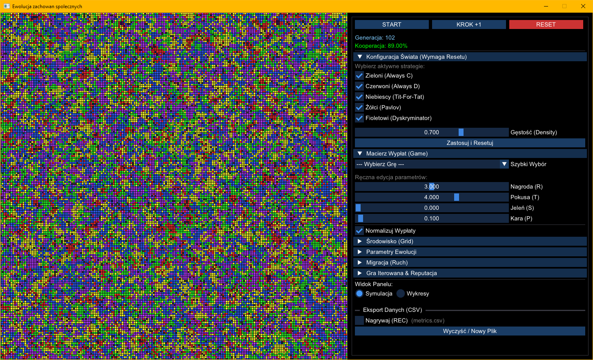
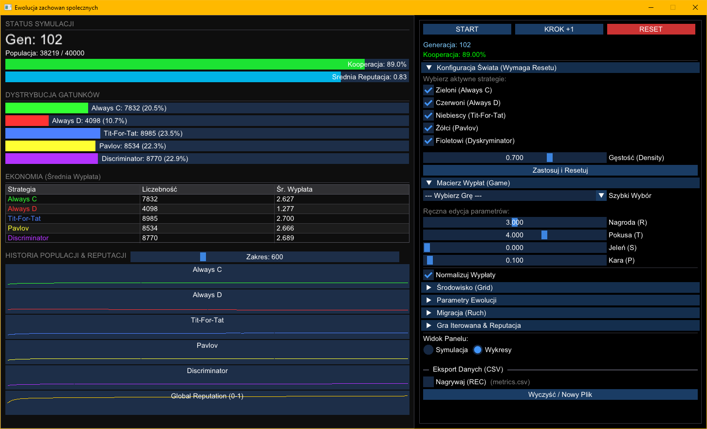

# Evolutionary Game Theory Simulator

> Interactive spatial simulation of evolutionary game dynamics on a 2D grid.  
> Explore how cooperation, defection, memory, reputation, imitation, and migration shape populations over time.


## Overview

**Evolutionary Game Theory Simulator** is an interactive C++ application for studying how agent strategies evolve in a spatial environment.

Agents occupy a **2D lattice**, interact with their neighbors through repeated game-theoretic encounters, accumulate payoffs, and update or reproduce according to configurable evolutionary rules. The simulator combines real-time visualization, parameter tuning, and analytical views for exploring phenomena such as cooperation, clustering, reputation effects, and migration.

The project focuses on:
- spatial evolutionary dynamics,
- repeated local interactions,
- memory-based and reputation-based strategies,
- configurable game payoff matrices,
- interactive experimentation through a GUI.

The main view displays the population directly on the grid, with a control panel for configuring strategies, evolutionary rules, migration, and data export.



## Features

### Strategy set
The simulator currently supports five strategy types:

- **Always Cooperate**
- **Always Defect**
- **Tit-for-Tat**
- **Pavlov (Win-Stay, Lose-Shift)**
- **Discriminator**

### Spatial interaction model
- Agents live on a **2D grid**
- Configurable neighborhood:
  - **Moore** (8 neighbors)
  - **von Neumann** (4 neighbors)
- Configurable boundary conditions:
  - **Periodic**
  - **Fixed**
  - **Reflective**
  - **Absorbing**

### Evolutionary dynamics
- **Death-Birth** evolutionary mode
- **Imitation** evolutionary mode
- Imitation update rules:
  - **Best Neighbor**
  - **Fermi rule**
- **Mutation**
- **Success-driven migration**
- Strategy persistence tracked with **agent identity and age**

### Iterated interactions and reputation
- Multiple rounds per generation
- **Pairwise memory** for repeated local interactions
- **Global reputation** updated over time
- Reputation-sensitive **Discriminator** behavior
- Generalized **Pavlov** logic based on payoff outcomes

### Game configuration
Preset payoff matrices included for:
- **Prisoner’s Dilemma**
- **Stag Hunt**
- **Hawk-Dove / Chicken**
- **Harmony Game**

You can also manually edit:
- **R** — reward
- **T** — temptation
- **S** — sucker’s payoff
- **P** — punishment

During a run, the grid makes it easy to observe spatial clustering, coexistence, and the spread of strategies over time.



### Visualization and analytics
- Live **grid view** of the population
- Dedicated **analytics view**
- Population composition by strategy
- Cooperation level
- Average reputation
- Average payoff per strategy
- Historical plots for:
  - strategy populations
  - global reputation

The analytics screen provides a compact summary of the current state of the simulation, including cooperation level, species distribution, average payoff, and population history.



### Data export
- Built-in **CSV recording**
- Metrics are written to `metrics.csv`
- Quick reset/clear for new experiment runs

## How it works

Each generation consists of three main stages:

1. **Migration**  
   Agents may move to a neighboring empty cell if it offers a sufficiently better expected payoff.

2. **Repeated local games**  
   Agents interact with neighbors for a configurable number of rounds per generation. Their behavior depends on strategy, pairwise memory, and reputation.

3. **Evolution update**
   - In **Death-Birth**, agents may die and empty cells are repopulated by neighboring agents weighted by fitness.
   - In **Imitation**, agents may adopt the strategy of a selected neighbor using either a deterministic or probabilistic rule.

## Tech Stack

- **Language:** C++20
- **Build system:** CMake
- **Graphics:** SFML 3
- **GUI:** ImGui + ImGui-SFML
- **Parallelism:** OpenMP

## Platform and toolchain

The project is currently developed and tested primarily on **Windows**.

The provided CMake presets are configured for:
- **Clang / LLVM**
- **Ninja**
- **x64** and **x86** builds

The codebase also contains some Windows-specific parts, such as `Windows.h`, `SetProcessDPIAware()`, and font loading from the Windows fonts directory, so the current setup should be treated as **Windows-focused**.

## Building

This project uses **CMake** and fetches its main dependencies automatically with **FetchContent**, so **SFML**, **ImGui**, and **ImGui-SFML** do not need to be installed manually.

### Requirements

To clone the repository:
- **Git**

To build the project using the provided Windows presets:
- **LLVM / Clang**
- **Ninja**
- **CMake**
- **Git**

The project also requires:
- a compiler with **C++20** support
- **OpenMP**

If you want to build the project exactly as configured in this repository, make sure `clang`, `clang++`, `cmake`, and `ninja` are available in your environment before running the commands below.

### Configure and build

Recommended Windows build using the provided preset:

```bash
cmake --preset x64-release
cmake --build build/x64-release
```

Debug build:

```bash
cmake --preset x64-debug
cmake --build build/x64-debug
```

### Run

```bash
.\build\x64-release\bin\Social-evolution.exe
```

## Controls

* **START / PAUSE** — run or stop the simulation
* **KROK +1** — advance by one generation
* **RESET** — restart using current settings
* **Symulacja / Wykresy** — switch between grid and analytics views
* **REC** — enable CSV recording

## Default simulation layout

The default grid size in the code is:

* **200 × 200 cells**
* up to **40,000 positions** in the world

## Project structure

```text
.
├── include/
│   ├── Agent.hpp
│   ├── Grid.hpp
│   ├── GuiPanel.hpp
│   ├── LeftPanel.hpp
│   ├── Simulation.hpp
│   ├── SimulationApp.hpp
│   ├── SimulationRenderer.hpp
│   └── constants.hpp
├── src/
│   ├── Agent.cpp
│   ├── Grid.cpp
│   ├── GuiPanel.cpp
│   ├── LeftPanel.cpp
│   ├── Simulation.cpp
│   ├── SimulationApp.cpp
│   ├── SimulationRenderer.cpp
│   └── main.cpp
├── media/
├── CMakeLists.txt
└── CMakePresets.json
```

## Example questions this simulator can explore

* When does cooperation emerge in a spatial population?
* How stable is Tit-for-Tat under local repeated interaction?
* How does migration affect cooperative cluster formation?
* What payoff regimes favor defection, coexistence, or full cooperation?
* How does reputation influence long-term population structure?
* How different are Death-Birth and Imitation dynamics in practice?